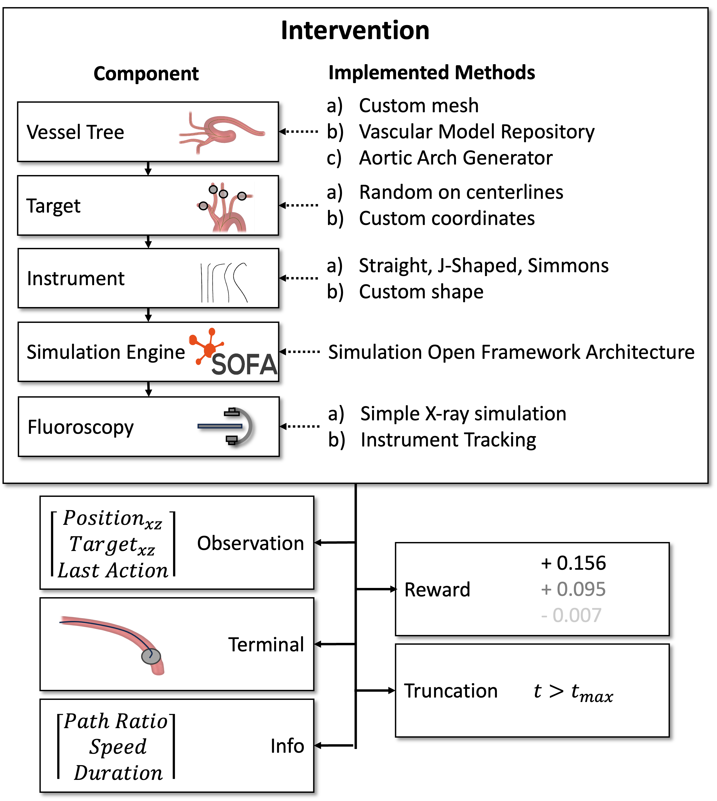

# EVE (Endovascular Environment)
Framework for the creation of simulations of endovascular interventions using the [SOFA simulation framework](https://www.sofa-framework.org) as simulation engine. EVE was designed for reinforcement learning and offers the seamless integration of *state*, *reward*, *terminal*, *truncation* and *info* features as defined by the [Farama gymnasium](https://gymnasium.farama.org) and can therefore be integrated with any RL framework adhering to this standard. Nevertheless, it is possible to use the simulated intervention for other purposes.

During design high priorities were modularity and pythonic way of usage. Resulting in the following architecture. 



## Getting started

Framework was tested under Ubuntu, MacOS (Apple Silicone) and Windows, although setting up SOFA can be more or less difficult.

1. Follow the [instructions](##Install-SOFA-with-SofaPython3-and-BeamAdapter) to install SOFA with SofaPython3 and BeamAdapter.
2. Install EVE package
   ```
   # (optional) Activate your python virtual env of choice (needs to work with SOFA)

   python -m pip install -e .
   ```
3. Test the installation
    ```
    python examples/function_check.py
    ```

## Install SOFA with SofaPython3 and BeamAdapter
From experience, setting up SOFA with SofaPython3 is the most difficult part. If Python 3.8 is sufficient for you, using the binaries is recommended.

### SOFA Binaries 
1. Get the [SOFA binaries <= v23.06](https://www.sofa-framework.org/download/)  and install dependencies. Unfortunately in v23.12 the BeamAdapter interface changed and adaption is still pending. 
2. Set environment variables as described [here](https://sofapython3.readthedocs.io/en/latest/content/Installation.html#using-python3). SOFA_ROOT is necessary for SOFA to run properly. 
PYTHONPATH helps Python find the SOFA Python packages, this can be replaced by linking the SOFA Python packages (normally: $SOFA_ROOT/plugins/SofaPython3/lib/python3/site-packages) to the site-packages of the sofa instance your are using (Sofa, SofaRuntime, SofaTypes, splib) using ```ln -s <source> <target>```
 
### Compile SOFA yourself
This method is more flexible, but also more difficult. Especially the details are platform specific. You can find build instructions for [Linux](https://www.sofa-framework.org/community/doc/getting-started/build/linux/), [MacOS](https://www.sofa-framework.org/community/doc/getting-started/build/macos/) and [Windows](https://www.sofa-framework.org/community/doc/getting-started/build/windows/). 

Here are some high level instructions for compiling Sofa specifically that worked well for this project so far (feel free to alterate and adjust to whatever gets Sofa compiled):
1. Make a Python virtual environment with the Python version of your choice (e.g. conda, pyenv, venv).
2. Install ```numpy scipy pybind11``` into that python env 
3. Create a directory for sofa (e.g. "mySofa") with a "src" and a "build" folder in it. 
```
mySofa
├── build
└── src
```
4. ```cd <mySofa>```
5. ```git clone -b v23.12.00 --depth 1 https://github.com/sofa-framework/sofa.git ./src``` 
   
   Exchange version for what you require
6. ```export PYTHON_EXEC=<path to python executable>``` 
   
   Path to the Python executable of the version you want to use. Sofa will work only for this version.
7. ```export PYTHON_LIB=<path to lib of the above pyhton version>``` 
   
   The lib should include the "libpython3.x.y" file. x depends on your version, y depends on your operating system.
8.  ```export PYTHON_INCLUDE=<path to include dir of the above pyhton version>``` 
   
    Normally there is a folder "include/python3.x" with the installation 
9. ```export PYBIND11_DIR=<path to share/cmake/pybind11 dir>```
    
    If installed with python, can be found in the "site-packages" folder of python (e.g., ".../site-packages/pybind11/share/cmake/pybind11/")
10. ```export PYTHON_SITE_PACKAGES=<path to site-packages dir of above python>```

    Depends on your method of using python (e.g., virtual env). This is the folder where the Sofa packages will be linked to, meaning that the python version of this site-packages will be able to find the Sofa package without the PYTHONPATH environment variable. 
11. ```export QT_DIR=<path to qt5>```

    This tells cmake where to find qt. Theoretically not necessary, but experience showed, that this needs to be done. 
12. 
```
cmake \
-D CMAKE_PREFIX_PATH=$QT_DIR \
-D SOFA_FETCH_SOFAPYTHON3=True \
-D SOFA_FETCH_BEAMADAPTER=True  \
-D Python_EXECUTABLE=$PYTHON_EXEC \
-D Python_LIBRARY=$PYTHON_LIB \
-D Python_INCLUDE_DIR=$PYTHON_INCLUDE \
-D pybind11_DIR=$PYBIND11_DIR \
-D SP3_LINK_TO_USER_SITE=True \
-D SP3_PYTHON_PACKAGES_LINK_DIRECTORY=$PYTHON_SITE_PACKAGES \
-G "CodeBlocks - Unix Makefiles" \
-S ./src \
-B ./build
```
12.
    
```
cd build
make -j
make install
```

```make -j``` will compile the src files with all available processes. You might want to restrict that with ```make -j <n>```, where n is the number of processes. 

```make install``` will link the python packages among other stuff. 

## How to use

Endovascular environments are created in the following order (from top to bottom):
```
    ├── Vesseltree
    ├── Device
    ├── Fluoroscopy
    ├── Simulation
    ├── Target
├── Intervention
├── Start
├── Pathfinder
├── Interimtarget
├── Observation
├── Reward
├── Terminal
├── Truncation
├── Info
├── Visualisation
Env
```

For each component you can use the existing classes or implement your own based in the interface defined in the base class. The components can have all predecessors as dependencies.
During usage of the environment reset() and step() will be called in the same order. 

Have a look in the *examples* folder for usage!.

**Env** is the main class and implements the Farama gymansium interface. It offers the functions
- reset(): Resets environment and initilializes on first use.
- step(action): Perform action for one timestep.
- render(): Render the environment for human use using the visualization method.
- close(): Close the environment.

An Env bundles the following compnents, which all implement reset(), step() and close(). An Env will call them in the given order:


- **Intervention:**
The intervention class bundles all components necessary for the simulation of an intervention. It can be used standalone with a visualisation or integrated in an Env. 

- **Vesseltree:**
Provides a mesh model of the vesseltree and the insertion point for the simulation and additional information (e.g. centerlines). 

- **Device:**
Provides information about the device shape to the information. Can be either a parameterized standard shape or a freeform device. 

- **Fluoroscopy:**
Provides feedback of the device in the vesseltree. Either as simulated x-ray or as tracking coordinates, corresponding to a tracking algorithm applied to the x-ray images. 

- **Target:**
Provides a navigation target for the intervention. 

- **Start:**
Adjusts the start position of the intervention. By default at the insertion point.

- **Pathfinder:**
Searches the path from the current instrument tip position to the target along the centerlines of the vessel tree. Provides the information as ordered point cloud and path length. 

- **Interimtarget:**
Provides additional interim targets. 

- **Observation, Reward, Truncation, Terminal and Info:**:
Provide observation, reward, truncation, terminal and info for reinforcement learning according to the gymnasium definition. Offers a modular approach to flexibly combine and augment observations.